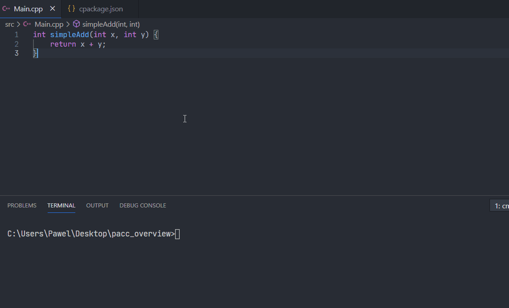
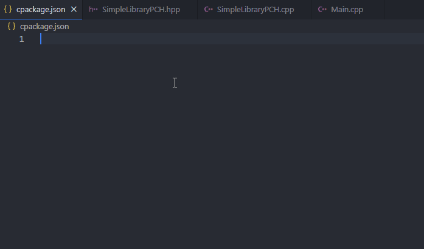

# Pacc

An easy to use and powerful C++ package manager with an integrated build tools.

<hr/>

**Note**: this project is under development. Wait for first alpha release.

<hr/>

## Overview (early 05.2021)


### Configure projects easily with JSON


```json
{
	"name": "HelloWorldProject",
	"type": "app",
	"files": "src/Main.hpp"
}
```

### Rich editor support

- Self-explainatory syntax and naming
- Good docs
- Rapid development
- Editor does most of the job for you

<p align="center">
	
</p>

Set up libraries and applications with few clicks or keystrokes.

### Build with ease

All you need is a single command.

```
pacc build
```

<p align="center">
	
</p>

### Automatic toolchain detection

Installed toolchains are detected automatically (but [manual setup](res/docs/ManualToolchainSetup.md) is also supported):

```
pacc tc
```

<p align="center">
	
</p>


### Insanely fast precompiled header setup

Use `"pch"` field inside `cpackage.json` to set up Precompiled Headers easily:

<p align="center">
	
</p>

## 1. Quick Start

Download the package manager and then do the following:

### 1. To create a new project:

Open a terminal inside an empty folder and type the following command:

```
pacc init
```

This will create a default package inside the current folder (see [init templates](docs/InitTemplates.md)).

### 2. To build a package

Run following command

```
pacc build
```

This will regenerate build files and build the application with default mode (see [build modes](docs/BuildModes.md))

## 2. Example package

Folder contents:
```
- cpackage.json
- src/
	- Main.cpp
```

`cpackage.json` contents:

```json
{
	"name": "HelloWorld",
	"type": "app",
	"files": "src/*.cpp"
}
```

`Main.cpp` contents:
```cpp
#include <iostream>

int main() {
	std::cout << "Hello, World!";
}
```