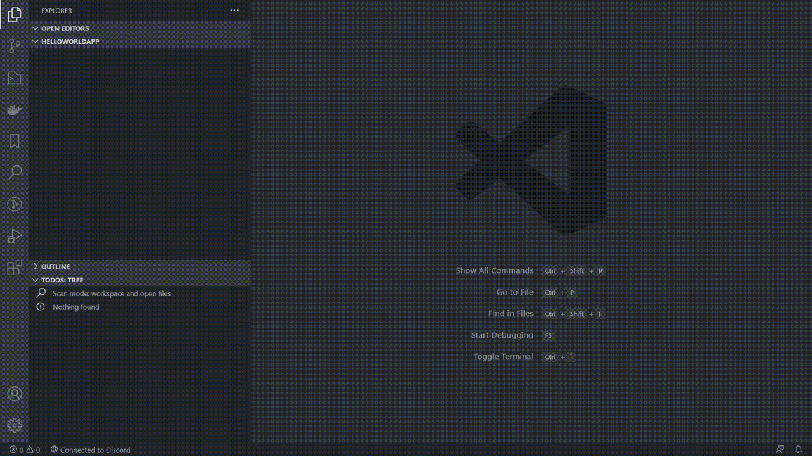

# Pacc

An easy to use and powerful C++ package manager with an integrated build tools.
## Overview (04.2021)


<p align="center">
	
</p>

## 1. Quick Start

Download the package manager and then do the following:

### 1. To create a new project:

Open a terminal inside an empty folder and type the following command:

```
pacc init
```

This will create a default package inside the current folder (see [init templates](docs/InitTemplates.md)).

### 2. To build a package

Run following command

```
pacc build
```

This will regenerate build files and build the application with default mode (see [build modes](docs/BuildModes.md))

## 2. Example package

Folder contents:
```
- cpackage.json
- src/
	- Main.cpp
```

`cpackage.json` contents:

```json
{
	"name": "HelloWorld",
	"type": "app",
	"files": [ "src/*.cpp" ]
}
```

`Main.cpp` contents:
```cpp
#include <iostream>

int main() {
	std::cout << "Hello, World!";
}
```