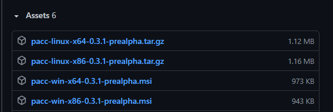

# Installation guide

Grab the **pacc** package for your system, from [latest release](https://github.com/PoetaKodu/pacc/releases), then follow instructions below.

<p align="center">
	
</p>

## Windows

Run the installer.

After installation, add `path/to/pacc/bin` to user's **PATH** environment variable.  
For example:

```
C:\Program Files\pacc\bin
```

## Linux

Extract the archive. Probably the best option is to extract it to:

```
/usr/local/bin
```

`// TODO: ^ this needs to be checked`

Edit `.bashrc` at your home directory (add at the end of the file:
```bash
PATH=$PATH:/usr/local/bin/pacc/bin
```
To update PATH variable, execute following command:

```bash
. ~/.bash_rc
```

## 😄 Voila!

You can now use **pacc**:

```
pacc init

pacc build

pacc run
```


Suggestion: visit [Getting Started](GettingStarted.md) page.